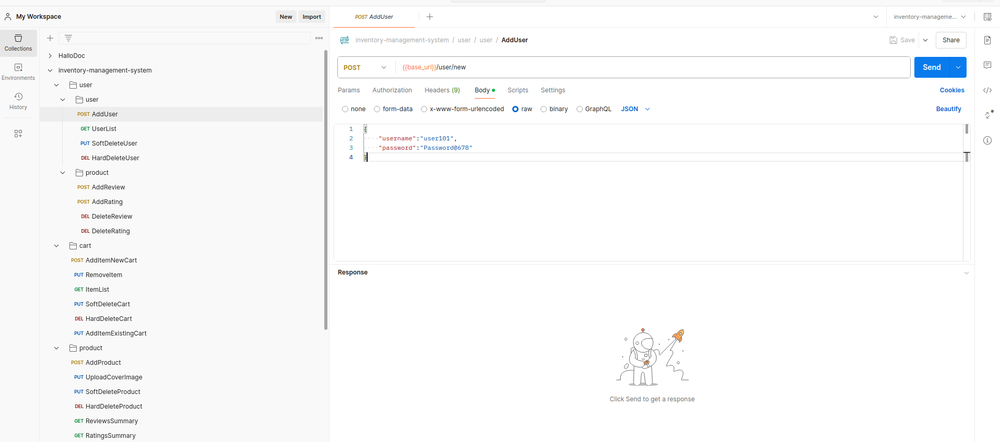

# Trainee Project

# Inventory Management System

## Description

This project is an inventory management system designed to efficiently handle product management, user interactions, and dynamic attribute customization. It includes modules for managing products, users, and carts, each with specific functionalities and access levels. Administratores can add products to carts with customizable attributes and options and have full control over product, cart and user management. The system allows dynamic addition and removal of product attributes and options, enhancing flexibility and usability.

## Technologies Used

- Typescript
- Javascript
- NodeJs
- MongoDB

## Badges

## Visuals

`Screenshots of postman collection for getting visual interpretation of the API's which you can integrate in your front-end.`

- 
- 

## Installation

To install and run the project locally, follow these steps:

1. Clone the repository:

   `Currenly no repository`

2. Install dependencies:
   `npm install`
3. Set up environment variables (if required).

4. Lint the code and solve linting errors
   `npm run lint` & `npm run lint:fix`

5. Seed the database:
   `no seeders in this project`
6. Build the project:
   `npm run build`

7. Start the server:

   \*With nodemon
   `npm run dev:watch`

   \*Without nodemon
   `npm run dev`

## Usage

- Admin Module:

  - Registering and managing users.
  - Managing products (add, update, delete - soft and hard).
  - Managing product reviews and ratings.
  - Managing product attributes and options.
  - Adding and removing products with specific attributes and options.
  - Uploading product images.
  - Authentication and profile management.

- User Module:

  - Browsing and getting list of products.
  - Adding products to carts with customizable attributes and options.
  - Writing reviews and ratings for products.
  - Managing cart contents and quantities.

## Support

- Upcoming features and improvements:

  - Integration with external inventory management systems.
  - Advanced analytics and reporting.

## Contributing

- We welcome contributions! Please follow these guidelines:

  - Fork the repository and create your branch from main.
  - Ensure your code follows our coding standards.
  - Submit a pull request detailing your changes.

## Authors and acknowledgment

- Ataa Vohra - Lead Developer

## License

- This project is licensed under the ISC License. See the LICENSE file for details.

## Project status

`Development is ongoing with regular updates and improvements.`
